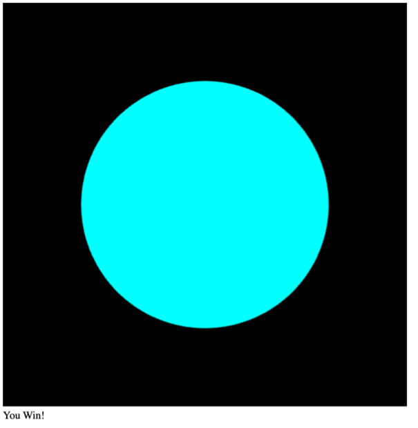

# 3D_SuperBugZapper

When html file is open, sphere appears on the black background as shown above

When user drags the sphere by pressing the mouse down inside the canvas and dragging along the y axis, sphere rotates on x-axis as shown above

If user drags the sphere along the x axis, sphere rotates on y-axis as shown above (note: the above picture is after sphere is rotated along the y-axis and then x-axis).

Overall user can rotate the sphere towards all directions to see all the surface. 

Different color bacteria’s start growing on the surface of the sphere starting at a random spot and grow out uniformly in all directions until it reaches a certain threshold. Then it stops growing.

When one of the bacteria’s reaches the threshold game displays a message that bacteria win!

Player wins if all the bacteria in the sphere are poisoned. Player achieves this by rotating the sphere to find bacteria and clicking to bacteria before it reaches a threshold